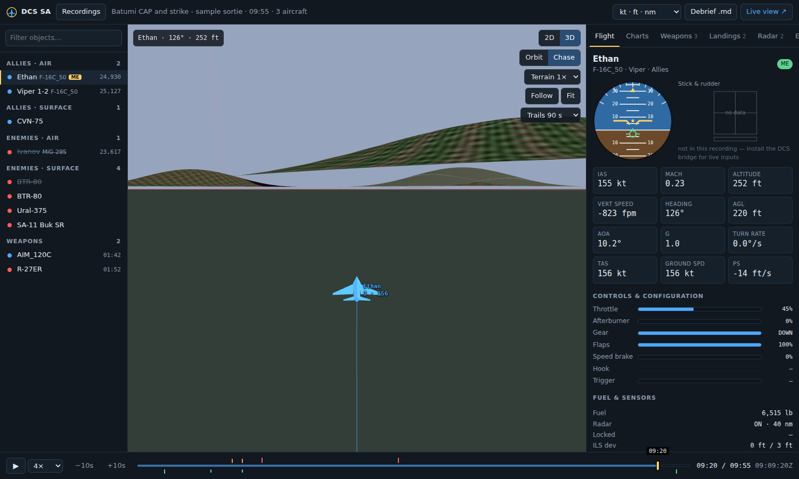
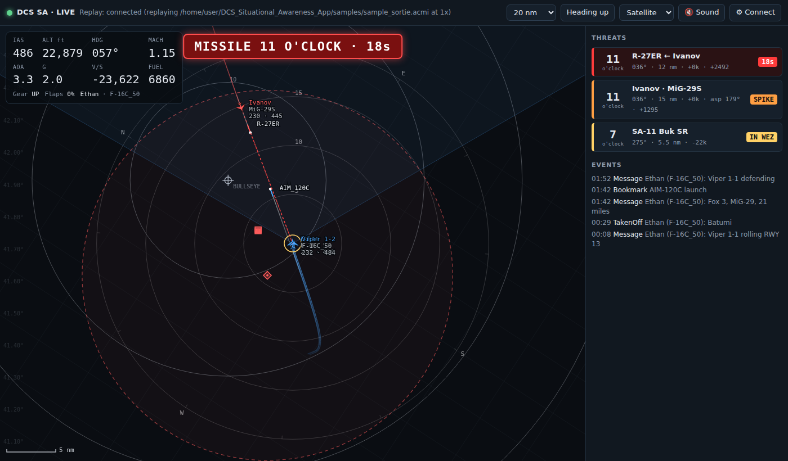

# DCS Situational Awareness

A desktop app for **DCS World** that shows you everything about a sortie. It works **live on a second screen** while you fly, and as a detailed **debrief** afterwards.

It reads **Tacview** data. Tacview is the program; **ACMI** (`.acmi`) is its file format.

> ### 👉 New here? Start with the **[step-by-step guide (GETTING_STARTED.md)](GETTING_STARTED.md)**
> How to download and install the app, try the demo flights, record your own flights in DCS and set up the live second screen, with every click spelled out. No experience with GitHub needed.





## What you get

| | Live (second screen) | Debrief (after the flight) |
|---|---|---|
| **Map** | **3D** (terrain + satellite imagery; orbit, chase or **padlock** camera) or heading-up 2D tactical map with range rings; arrows on the edge point at off-screen threats | Full replay in **3D** or 2D at 0.1× to 64×, next/previous event, **A–B loop**, measuring tape, trails coloured by altitude / speed / G / energy / AOA |
| **Your aircraft** | IAS and altitude with trend arrows, live **Ps**, heading, Mach, AOA, G, V/S, fuel with endurance, **bingo / joker** with bearing and range home; a big-number **Glance** layout | Attitude indicator, all flight data at any moment, charts over the whole flight |
| **Your inputs** | Stick / rudder deflection (via the DCS bridge) | Stick & rudder display, throttle/afterburner, brakes, hook, trigger |
| **Radar** | Your radar cone, lock lines, **RWR scope** | Lock episodes (who, range, how long, how it ended), who locked *you* |
| **Threats** | Inbound missiles with **time-to-impact** and clock position, spikes, hot bandits, SAM rings you're inside, optional audio warning | — |
| **Weapons** | Stores remaining, chaff/flare counts, a **HIT** alert when DCS reports you were hit | Every shot: shooter, target, launch range, aspect, time of flight, **kill / miss**, and a **"why did it miss?"** card (launch geometry, missile Mach and range to target, when the target beamed or turned cold); gun bursts with bullet paths, rounds on target and **hits reported by DCS**; kills **confirmed by DCS**; Pk per pilot |
| **Ground attack** | Your weapons in flight with **time to impact** and predicted impact point, the **JSOW launch zone** around your jet (from DCS's own table), your marked target with **IN RNG**, wrecks and DCS hits on the map | Release marks with release parameters, whole weapon paths with **time-of-fall ticks**, the JSOW-A / cluster **bomblet pattern**, impact and **miss split into long/short and left/right**, **BDA**, a **Strike** tab (targets, passes, a **strike card** per weapon) |
| **Landing** | — | Approach glidepath and centreline charts, gates at 4 to 0.25 nm, touchdown sink rate / speed / AOA / crab, stabilised-approach check, the **real runway from DCS** (touchdown distance past the threshold, runway remaining), **grade** (LSO-style on the carrier) |
| **All aircraft** | Every contact with labels | Stats for every aircraft; select any of them for full telemetry |

## Install (Windows)

It's a normal desktop app: install it once, then open it from the **DCS SA** icon on your desktop.

**Option A: the installer (recommended)**
1. On GitHub open **Actions → Build Windows exe** (you must be signed in), click the newest run with a green tick, and under **Artifacts** download **DCS-SA-windows** (a zip with `DCS-SA-Setup.exe` and `DCS-SA.exe`). If there is a Release, `DCS-SA-Setup.exe` is attached there too.
2. Unzip it and run `DCS-SA-Setup.exe` (on "Windows protected your PC", click **More info → Run anyway**: the exe isn't code-signed). It installs for your Windows user only (no admin rights needed) and adds **DCS SA** (the debrief) and **DCS SA Live** (straight into the second-screen view) to the Start menu, plus a **DCS SA** desktop icon; tick the box for a **DCS SA Live** desktop icon too.
3. Double-click **DCS SA**. It opens in its own window; close the window to quit.

**Option B: the single exe.** The same download has `DCS-SA.exe`. Put it where you want to keep it, then double-click it. The first time it runs, it adds the **DCS SA** icons to your desktop and Start menu (pointing at where it is then, so don't move it afterwards). Use either the installer or the single exe, not both; if the installer has been used, the single exe leaves the icons alone.

**Option C: run from source**
1. Install [Python 3.10+](https://www.python.org/downloads/) (tick *Add to PATH*).
2. Double-click `Create Desktop Shortcut.bat` once to get the desktop icon, or `run.bat` to just start it. For native windows instead of an app-style browser window, also run `pip install pywebview`.

To build the exe yourself, double-click `build_exe.bat`; the result is `dist\DCS-SA.exe`.

## Set up DCS (one time)

1. **Recordings for the debrief:** in DCS go to *Options → Special → Tacview*, then enable recording. Files land in `Documents\Tacview` and the app finds them automatically. You can also drag and drop any `.acmi` onto the app.
2. **Your jet live on the second screen, and DCS's own map in 3D:** open the live view (*Live view ↗* button), click **⚙ Connect**, then **Install DCS bridge into Export.lua**. Restart DCS (quit to the desktop and start it again: DCS only reads the scripts when it starts). This installs two small scripts, and the app keeps them up to date when it is updated. One streams your own aircraft (flight data, inputs, stores, RWR); the other (`Scripts\Hooks\DCS-SA-Hook.lua`) lets the app read DCS's terrain and airfields. Your other exporters (Tacview, SRS, DCS-BIOS) keep working.
3. **Everyone else live (optional):** Tacview's *real-time telemetry* streams every aircraft and missile. Enable it in the Tacview settings in DCS, then in the live view use **⚙ Connect → Tacview → Connect** (default `127.0.0.1:42674`); the app remembers it and reconnects on its next start. DCS SA connects to DCS's own Tacview exporter directly, so you shouldn't need to buy anything: Tacview's paid **Advanced** edition is what the *Tacview program* needs to show real-time telemetry, and DCS SA doesn't use that program. (Not yet tested against every DCS version; recordings and the bridge never need it.)

On a multiplayer server the server decides what may be exported. The bridge only ever *reads*, and anything the server blocks simply doesn't appear.

**Your profile:** the app reads the active pilot from your DCS logbook (`Saved Games\DCS\MissionEditor\logbook.lua`) and uses that name to pick *your* jet in recordings and live. You can override it in `dcs-sa.toml` (see `dcs-sa.example.toml`) or click **This is me** on any aircraft.

## The 3D view

Click **3D** in the top-right of either view.

* **Terrain comes from DCS itself** whenever it can. The DCS-SA hook (installed with the bridge) asks the running game for ground height and surface type (land, water, road, runway) plus every airbase and runway, through DCS's official scripting API. No game files are read. Your jet sits on exactly the terrain the game uses, and DCS's water, roads and runways are drawn in. Everything it samples is cached, so later debriefs of that area use the game's terrain even with DCS closed. This works in single player and on servers you host; when you're a client on someone else's server, the view uses the online data below. The corner of the 3D view shows which source is in use.
* **Otherwise** terrain is real elevation data (AWS open terrain tiles) draped with Esri satellite imagery: about 60 m/pixel out to ~100 km, and about 14 m/pixel within ~30 km of the selected aircraft. It streams in as you move. Tiles are cached in `Documents\DCS-SA\tilecache`, so areas you've flown before load instantly and work offline.
* **Aircraft** are drawn as 3D models posed with their recorded heading, pitch and bank. At long range they're scaled up so you can still see them.
* **Weapons** leave smoke trails. Lock lines are dashed yellow. SAM envelopes are domes.
* **Orbit** camera: drag to rotate, scroll to zoom, right-drag to pan; it follows the selected aircraft. **Chase** puts you behind the aircraft. **Padlock** sits behind your jet looking at its target (your radar lock, else the nearest bandit, or anything you Shift-click; **T** cycles through bandits and missiles aimed at you) with a range readout on the sightline. Click any aircraft to select it.
* Threats you can't see get **arrows on the screen edge** (red: missile inbound with time to impact, orange: someone locked you, yellow: hot bandit).
* **Terrain 2× / 3×** exaggerates relief when you want low-level terrain masking to stand out.

## Ground attack and the JSOW

Every air-to-ground weapon in a recording (JSOW, JDAM, laser-guided and dumb bombs, cluster bombs, Mavericks, HARMs, rockets) gets a **strike** record, and the debrief draws it:

* **Release mark** (the triangle where you pickled) with altitude, Mach, dive, G and bank. The weapon's **whole path** follows, with a tick every 5 s of its fall (10 s for a long JSOW glide). Nothing appears before it happens.
* **While it flies:** a dashed line to its target and a countdown ("AGM-154A → Ural-375 · opens 0:18"), plus a *Weapons in flight* list on the map.
* **JSOW-A and cluster bombs:** the point where the dispenser **opened** and its height above the target, every **BLU-97 bomblet** as a dot where it landed, and the pattern's ellipse ("145× BLU-97 · 320 × 195 ft"). The bomblets never flood the object list; they're counted on their JSOW's row.
* **Impact:** a circled X coloured by result (red destroyed, orange damaged, grey miss), the miss to the target split into **range and deflection** along your run-in ("22 ft LONG · 60 ft R · 2 o'clock"), an arrow when the target **moved** during the time of fall (coordinate-guided weapons don't follow movers), and **BDA badges** ("3 K").
* **JSOW launch zone:** DCS's own AI launch table for the AGM-154 (max and min range for your release altitude and speed) is drawn around the target, with the fraction of max range you released at.
* **Strike tab:** the strike summary, a **target board** grouped by site (e.g. "BTR-80 group · 3/4 destroyed · restrike"), and every pass. Open a **strike card** for the release parameters, a bomb plot (run-in up, with the miss and the pattern), a side profile of the release and fall, fly-out charts, the attack run, and plain-language verdicts.
* **Mark my path inside SAM rings** colours the flown path red where you were inside a hostile SAM envelope ("in SA-11 WEZ 38 s").
* In **3D**: release posts, weapon paths, bomblets as a cloud, the pattern draped on the terrain, and a **weapon cam** (W) that rides the JSOW or bomb down to impact.

**Live, on the second screen** (A-G mode, or turn the layers on in **Display**):

* **My weapons:** each weapon you release gets a dashed line to its predicted impact and an estimated time to impact ("AGM-154A → SA-11 SR · ~0:38"), and a *My weapons* panel counts them down. Afterwards the tag shows KILL or HIT when DCS reports one.
* **JSOW range:** with a JSOW selected on your stores page, rings around your jet show DCS's max and min range for your altitude and speed. With a target marked, the strip reads **IN RNG**, or how far and how long until you are.
* **Target:** mark any ground unit or map point as your target (right-click it): a diamond on the map and bearing/range in the strip. **Wrecks** and **DCS hits** show where they happened.
* SAMs are listed by how far you are from their engagement zone ("WEZ in 4.1 nm", "IN WEZ").

The demo `samples/sample_strike.acmi` has a full JSOW strike: two JSOW-As on a moving column and SA-11 launchers, a JSOW-C on the SA-11 radar, a GBU-12 and a dive-bombing Mk-82 that misses.

## Heat-seekers (AIM-9, R-73) and heat

DCS gives every aircraft type a heat value (its *IR emission coefficient*: 1.0 is a Su-27 without afterburner; an F-16 is 0.6 dry and 3.0 in afterburner, an A-10 0.53) and makes a jet look **×1.5 hotter from the tail, ×1 from the beam and ×0.5 nose-on**. Each IR missile has its own seeker data: how far it sees a heat-1.0 target, how easily flares fool it, its gimbal limit and whether it is all-aspect. The app ships these numbers from DCS's own files (`dcs_sa/web/data/ir.json`) and draws them:

* **Heat lobes** around jets (Display → Heat (IR); the selected jet and anything an IR missile is chasing, plus you in A-A): the teardrop points out of the tailpipe and its area is the heat DCS gives the jet, so afterburner makes it five times bigger on an F-16. Label: "IR 0.6", "IR 3.0 AB". The selection card adds how hot the jet looks from you ("seen from me ×1.35, 40° off its tail").
* **Afterburner is never guessed.** Tacview files carry engine data only for the recording player's jet, so the app knows *your* afterburner, from fuel flow (never the throttle, which some jets record wrongly). For everyone else the dry lobe is solid and the afterburner one is a dotted outline: "IR 0.77 · 4.0 if AB". Trail colour **Heat (afterburner)** shows when you had it lit (grey where it's not recorded), and the Flight tab's afterburner bar reads ON / OFF.
* **IR missiles in flight** get a glowing nose, their gimbal limit as two ticks, a line to what they're steering at with the look angle ("look 18°/45°"), and flares within 1° of that line ringed. When the missile's predicted miss becomes far smaller against a flare than against the jet, the line **jumps to that flare** and says so: "went for a flare? +2.4 s (est.)". Rear-aspect-only missiles (AIM-9P, R-3S) show the cone behind the target they had to be fired from.
* **Flares** are coloured by the jet that dropped them (DCS doesn't record whose they are; the app takes the jet they appeared next to) and fade over their 9 s life with a short smoke tail. Click one: "Flare · from Ivanov (nearest jet at release, 9 m) · salvo of 6". Chaff is drawn apart (grey) and never counted as flares. The timeline lists the salvos that matter ("Ivanov flares x6") and each likely decoy.
* **Shot card** for an IR shot: seeker facts from DCS (all-aspect or rear-only, flare resistance, gimbal, launch look angle, fuze, seeker power time), the target's heat as the missile saw it ("MiG-29S heat 0.77 dry × tail 1.31 = 1.0 · 5.2 if in AB"), flares and chaff from the target, the likely decoy with its numbers, the closest the missile came to a flare, and charts of the **predicted miss** (log scale) and **look angle** against the jet and the best flare, and the heat the missile saw.
* **Seeker reach (estimate)**, off by default: a dashed shape around the target showing roughly how far that seeker could see it from each side. DCS doesn't publish how heat scales its seeker range, so this is labelled *est.*, is never used as a verdict, and is not launch range.

**Live:** a heat-seeker coming at you is tagged **IR** (amber) with its own three-beep warning, since your RWR can't see it: "IR MISSILE 3 O'CLOCK · 3s · NO RWR", plus "AB!" when your afterburner is lit. Its row says which part of your jet it's looking at ("sees your TAIL ×1.5"). IR SAMs (SA-9, SA-13, MANPADS, Chaparral, Avenger) are tagged too. The A-A strip shows **HEAT AB 3.0 / DRY 0.6** once your fuel flow has shown both, your heat lobe is drawn with a tick towards each IR missile, and in Glance the fuel cell becomes your flare count while one is inbound.

Chips built on DCS's own seeker data carry a small **DCS** badge (on a warning, it means the limit it is compared with comes from DCS); estimates worked out from the recorded paths are dashed and marked *est.* DCS records no lock or tone, so the app never claims one.

The demo `samples/sample_dogfight.acmi` is an F-16 against a MiG-29: the first AIM-9M goes for the MiG's flares, the MiG's R-73 is beaten by a break and a flare burst, and the second AIM-9M kills the MiG from its six.

## Dogfight (A-A) and Ground attack (A-G) modes

The **ALL | A-A | A-G** switch in the top bar (keys **Shift+A** / **Shift+G**; press again to go back to ALL) changes what the map concentrates on. It only changes when you change it.

* **A-A:** aircraft, missiles and guns; ground units only where they can shoot at you; SAM rings only when you're near them; bandits get **BRAA** and bullseye calls; 10-second velocity vectors; energy-coloured trails; heat lobes on the selected jet, on you and on any jet an IR missile is chasing, and the seekers of IR missiles aimed at you or the selected jet; the Weapons tab shows the air-to-air shots.
* **A-G:** every strike mark, the JSOW launch zone, hostile SAM rings, ground-unit labels near the targets, 5-minute altitude-coloured trails, altitude stalks in 3D; opens the Strike tab.
* **ALL** is exactly your own settings. Anything you change while in A-A or A-G is remembered for that mode only (a coloured dot marks those rows in **Display**); **Reset** puts a mode back to its defaults.
* No mode ever hides a missile aimed at you, a spike, the missile warning or bingo.

**Display ▾** (key **D**) has every map option in one place: objects and coalitions, weapons and submunitions, strike marks, SAM rings, radar cones, lock lines, threat arrows, bullseye and BRAA, velocity vectors, heat lobes and IR seekers, grid, labels, trails, coordinates (decimal, the F-16 DED's deg-min, deg-min-sec or MGRS), and 3D stalks and lighting. **Z** declutters and **Z** again restores.

## Selecting things

Click anything to select it: a card on the map shows what it is, where it is (BRAA from you, bullseye), and its state (a weapon's time to impact or miss, a SAM ring and whether you're inside it). **Right-click** it (or press **E**) for everything you can do with it:

* **Follow**, **Padlock in 3D**, **Weapon cam**, **This is me**
* **Isolate** (X): show only it and what it touched (its shots and their targets, who shot at it, its locks, its group)
* **Its shots & strikes** / **What shot at it**, **open its strike or shot card**
* **Next / previous event of this object** (Shift+N / Shift+P), **jump to its death**, **loop its engagement**
* **Measure from here** and **Measure to me**, **Compare with me** (its telemetry dashed on your charts)
* **Always show its ring / radar**, **Mark as my target** (the strike marks re-score the miss against it), **Hide it**
* **Copy** its BRAA, bullseye call or coordinates (Ctrl+C; in the F-16 DED format with elevation for ground units, ready for a steerpoint)

Right-click empty map for a point menu (measure from here, mark as target, copy coordinates). In the object list, filter chips (Air, Surface, Weapons, Hostile, Alive) sit above the groups, and a group header folds it away.

## Read from DCS, not guessed

A Tacview recording only has positions, so some things in a debrief have to be worked out from geometry: which round hit, whether a kill counted, which runway you landed on. When the DCS-SA scripts are installed, the app **reads these from DCS instead**:

* **While you fly** the app keeps a small flight log (`Documents\DCS-SA\flightlogs`): DCS's own **shot / hit / kill** events (for each missile, its guidance type and the target it was launched at, which DCS's shot event itself leaves out), your control-surface deflections, your radar's **scan zone**, chaff/flare/gun counts, your engines' fuel flow, and which units have their **radar on**.
* **When you open the Tacview recording afterwards** the app finds the matching flight log, lines the clocks up by matching your flight path (it refuses if the paths don't agree), and uses what DCS reported: hits per gun burst, confirmed kills (and corrected kill credit where the geometry guessed wrong), the real radar scan zone, and radar on/off for every emitter. A cyan **DCS** tag marks every value that came from the game.
* **Landings** are graded against the runway DCS reports (position, heading and length): touchdown distance past the threshold, touchdown zone, runway remaining.
* **SAM / AAA / ship threat rings**: DCS recordings don't carry engagement ranges (Tacview adds them from its database when it plays a file), so the app uses the same numbers from Tacview's public object database and labels them as such.
* **Radar cones** say where they came from: *recorded* (the recording has radar data), *read from DCS*, or *assumed* for that aircraft type (drawn dashed; hide them with *Radars: known only*).

## Handy controls

Press **?** in either window for the full list.

* **Debrief:** Space play/pause · ← → ±5 s (Shift ±30 s) · **N / P** next/previous event · **I / O / L** loop in/out/on (or Shift-drag the timeline) · **, .** step half a second · **V** 2D/3D · **C** camera (orbit → chase → padlock) · **T** padlock target · **W** weapon cam · **M** measuring tape (or Shift-drag on the map) · **J / K** next/previous aircraft · **E** actions for the selection · **X** isolate · **Shift+N / Shift+P** the selection's next/previous event · **Ctrl+C** copy its position · **Shift+A / Shift+G** A-A / A-G mode · **D** Display · **R** SAM rings · **B** bullseye · **Z** declutter · **1–8** tabs · **Ctrl+O** recordings
* **Live:** **G** Glance layout · **V** 2D/3D · **C** camera · **T** padlock the next threat · **H** heading-up/north-up · **+ / −** range · **N** re-centre · **Shift+A / Shift+G** A-A / A-G mode · **D** Display · **E** actions for the selection · **B** back to my jet · **Ctrl+C** copy position · **S** sound · **Ctrl+,** connect
* **Live clicks:** a click selects a contact and shows its card; a double-click on an aircraft views the picture from it (**Back to my jet** returns).

When Tacview writes a new recording after a mission, a banner offers to open the debrief (tick *Auto-open* to skip the click).

## Try it without DCS

The app ships with three generated demo sorties. `samples/sample_sortie.acmi`: takeoff from Batumi, an AIM-120 kill, a notched R-27, a strafing pass and a landing. `samples/sample_strike.acmi`: a JSOW strike on a vehicle column and an SA-11 site, then a GBU-12 and a Mk-82 dive-bomb pass. `samples/sample_dogfight.acmi`: a turning fight with AIM-9Ms, an R-73 and flares. Open them from the recordings list. To see the live view in action without DCS, go to *⚙ Connect → Replay a recording*.

## Command line

```
python -m dcs_sa                        # desktop window (same as the exe)
python -m dcs_sa app --live             # open straight into the live view
python -m dcs_sa serve                  # browser tab instead; add --host 0.0.0.0 to use a tablet on your LAN
python -m dcs_sa analyze flight.acmi    # text debrief in the terminal (--json out.json for everything)
python -m dcs_sa serve --replay flight.acmi --speed 4   # feed the live view from a recording
python -m unittest discover -s tests -t .               # run the tests
```

## How it works

```
DCS World ─ Tacview exporter ─┬─ .acmi file ────────────▶ parser ─▶ analysis ─▶ Debrief UI
                              └─ real-time TCP :42674 ─▶ parser ─▶ live world ─▶ Live UI
          ├ DCS-SA-Export.lua ── UDP :42680 (your jet) ───────────┤         ▲
          └ DCS-SA-Hook.lua ──── UDP :42682 (terrain, airbases, ──┴─ flight log
                                 shot/hit/kill events)
```

* `dcs_sa/acmi/`: streaming ACMI 2.x parser (zip / plain / BOM, escaping, all transform variants, reference offsets).
* `dcs_sa/analysis/`: kinematics (G, turn rate, energy), weapons & kill attribution, takeoff/landing grading, radar locks, timeline; `strike.py` air-to-ground releases, impacts, bomblet footprints and BDA; `lar.py` the JSOW launch zone from DCS's AI launch table (`dcs_sa/web/data/jsow_lar.json`); `dcsmerge.py` merges a flight log into a recording.
* `dcs_sa/flightlog.py`: records what DCS reported during a flight; `dcs_sa/threatdb.py` + `dcs_sa/data/`: engagement ranges from Tacview's database.
* `dcs_sa/telemetry/`: Tacview real-time client (handshake + CRC-64 password), DCS bridge receiver, live threat picture.
* `dcs_sa/web/`: the UI (plain JavaScript, no build step; 3D via the bundled three.js). Map tiles are © Esri / OpenStreetMap / CARTO, and terrain comes from AWS Terrain Tiles. Offline, the map falls back to a grid.
* `dcs-scripts/DCS-SA-Export.lua`: the in-game bridge (your aircraft).
* `dcs-scripts/DCS-SA-Hook.lua`: samples DCS terrain and airbases on request via the official scripting API; `dcs_sa/dcsmap.py` caches them.

The app is Python standard library only. Nothing is sent anywhere except map and terrain tile requests.

## Known limits

* ACMI has no runway database. Without the DCS hook's airfield data, landings are measured against the point where you actually touched down (3.0° reference, 3.5° on a carrier).
* The flight log only covers your own session, so DCS-confirmed hits and kills are available for flights you recorded with the scripts installed; other recordings fall back to geometry, and say so.
* Stick input comes from control-surface deflection. On fly-by-wire jets (F-16, F/A-18) that's what the flight computer commanded, not raw stick position. A recording that carries Tacview's `PitchControlInput` etc. shows true inputs.
* If a recording doesn't mark weapon parents or lock targets, the app infers them (nearest launcher, closest approach) and labels the source.
* Heat values and seeker data are from DCS 2.9's files. Flare owners, "went for a flare" and seeker reach are estimates from the recorded paths; AI afterburner is not in Tacview recordings, so both values are shown.
